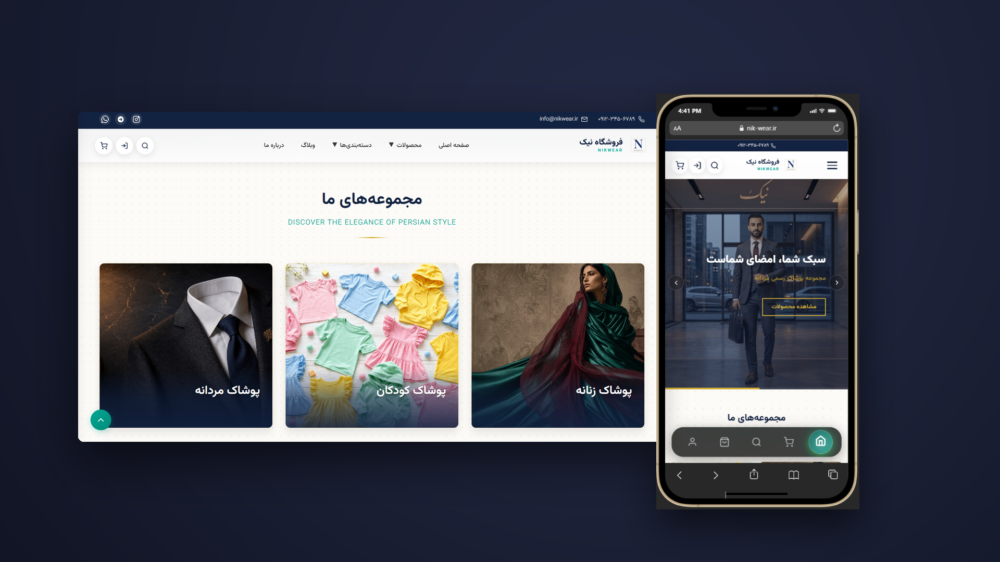
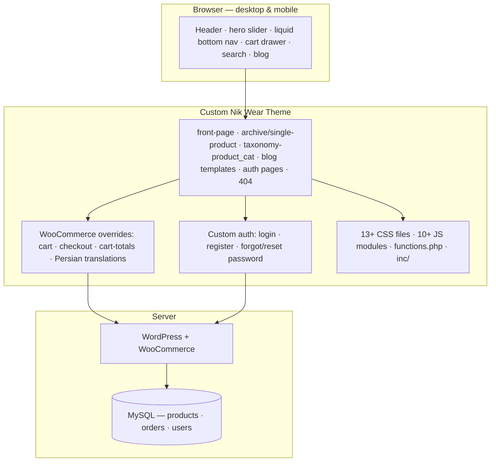
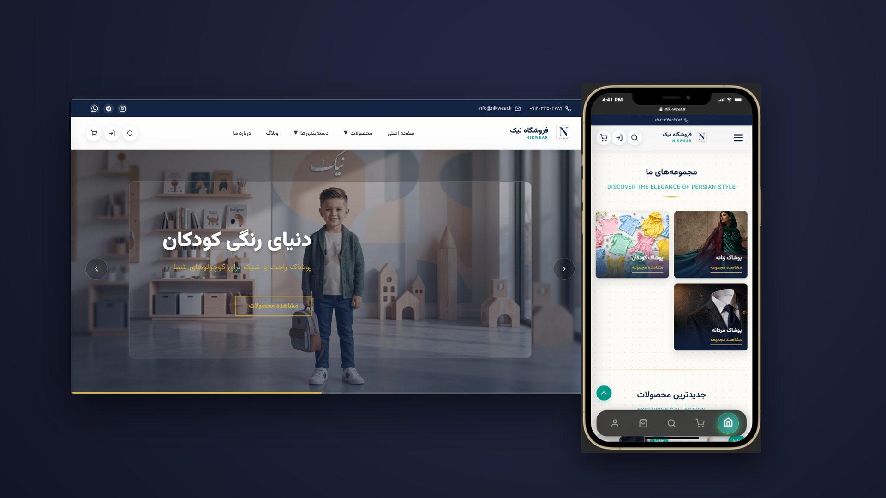
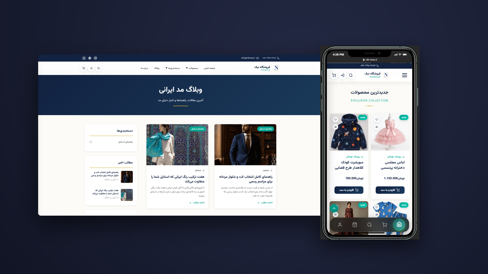

# Nik Wear — Custom WooCommerce E-Commerce Website & Theme

A **custom WooCommerce e-commerce website & theme** for a Persian fashion brand — menswear collections, kids' collections, and a fashion blog. The WordPress theme was **developed from scratch**: every template, stylesheet, and script was written for this store, and WooCommerce was customized deeply — cart, checkout, translations, and more. Beyond building, I handled deployment, SEO, performance optimization, and ongoing management.

---

## Table of Contents

- [Project Overview](#project-overview)
- [My Role](#my-role)
- [Problem / Purpose](#problem--purpose)
- [Features](#features)
- [Tech Stack](#tech-stack)
- [Development Work](#development-work)
- [SEO & Optimization](#seo--optimization)
- [Deployment & Management](#deployment--management)
- [Architecture](#architecture)
- [Screenshots](#screenshots)
- [Results](#results)
- [Related Projects](#related-projects)

## Project Overview

Nik Wear is a Persian (RTL) fashion store built on WordPress + WooCommerce with a **fully custom theme** — not a purchased template. The store sells through curated collections (menswear, kids), runs a fashion blog, and gives customers a complete shopping experience: hero sliders, a cart drawer, custom cart and checkout pages, and a custom member area with login, registration, and password recovery.

## My Role

I delivered this project **end-to-end**:

- **Theme development** — designed and wrote the complete custom WordPress theme: all template files, 13+ stylesheets, and 10+ JavaScript modules
- **WooCommerce customization** — rebuilt cart and checkout templates, cart logic, and Persian translations to match the brand
- **Custom authentication** — built the member login / register / forgot-password / reset-password system from scratch
- **Deployment** — hosting setup, domain configuration, SSL, and production launch
- **SEO** — search-engine-friendly structure, metadata, sitemaps, and Search Console setup
- **Performance & optimization** — image optimization, lean CSS/JS, and mobile-first loading
- **Ongoing management** — continuous maintenance, updates, and improvements

This wasn't "install a theme and add products" — the theme is my own code, and the store is my responsibility.

## Problem / Purpose

The brand needed a real online store that felt like the brand, not like every other WooCommerce shop:

- A distinctive design across desktop and mobile — hero sections, curated collections, and a blog
- A Persian, right-to-left experience customers already understand
- A complete shopping flow — cart drawer, custom cart, custom checkout — without plugin bloat
- A member area with proper authentication (login, registration, password recovery)
- An owner who is non-technical and must be able to run the store through WooCommerce's admin

## Features

**Custom Theme**

- Complete custom template set: `front-page`, `archive-product`, `single-product`, `taxonomy-product_cat`, `archive-blog`, `single-blog`, `taxonomy-blog_category`, `page`, `single`, `404`, and more
- `style.css` theme foundation + 13+ purpose-built stylesheets (header, hero slider, cart drawer, checkout, blog, auth, WooCommerce, and more)
- 10+ vanilla JavaScript modules (hero slider, liquid bottom nav, cart drawer, search, header, checkout, cart badge sync)

**WooCommerce Store**

- Custom cart templates — `cart.php`, `cart-totals.php`, `cart-empty.php`
- Custom checkout templates — `form-checkout.php`, `review-order.php`
- Cart core logic in `inc/cart-core-functions.php` + `inc/woocommerce-cart-functions.php`
- Custom checkout functions and Persian translations (`woocommerce-translations.php`)
- Featured products, curated collections, and product category pages

**Custom Authentication**

- Login, register, forgot-password, and reset-password templates
- Custom auth logic (`auth-functions.php`, `forgot-password-functions.php`) — no third-party membership plugin

**Storefront UX**

- Hero slider with animated sections
- Liquid bottom navigation for mobile
- Cart drawer with live badge sync
- Integrated search
- Fully responsive desktop + mobile layouts

**Content**

- Persian fashion blog with category pages and seed content (`inc/blog-seed-content.php`)

## Tech Stack

| Layer | Technology |
|---|---|
| CMS | WordPress |
| E-commerce | WooCommerce (customized cart, checkout, translations) |
| Theme | Fully custom theme — PHP templates, `style.css`, `functions.php` |
| Frontend | Vanilla JavaScript (10+ modules), custom CSS (13+ stylesheets) |
| Database | MySQL (products, orders, users) |
| Language | Persian (RTL) with custom WooCommerce translations |
| Hosting | Production web hosting, custom domain, SSL |

## Development Work

A closer look at the engineering:

- **Theme architecture** — a proper WordPress template hierarchy: `front-page.php` for the branded homepage, WooCommerce templates for the shop, custom taxonomy templates for categories, and dedicated templates for the blog and auth pages
- **WooCommerce overrides** — cart and checkout rebuilt in the theme's `woocommerce/` folder instead of relying on plugin defaults, with matching cart/checkout logic in `inc/`
- **Custom auth system** — complete member flows: login, registration, forgot-password (with recovery logic), and reset-password — all custom templates and functions
- **Front-end modules** — an animated hero slider, a liquid bottom navigation bar for mobile, a cart drawer that syncs with the cart badge, and a search experience — each as a dedicated JS module with its own stylesheet
- **Persian localization** — WooCommerce interface strings translated to Persian so the storefront feels native to Persian-speaking customers
- **Blog engine** — blog archive, single post, and category templates with seed content so the blog launched with real posts
- **Clean, maintainable code** — separated CSS per feature area and modular JS, so the theme stays fast to load and easy to maintain

## SEO & Optimization

- Semantic, search-friendly template markup throughout the theme
- Custom templates per content type (products, categories, blog) for clean, indexable structure
- Optimized images and lazy loading for fast mobile pages
- Lean CSS/JS delivery — modular files loaded where they're needed
- Search Console and sitemap setup for Google visibility
- *[Add your numbers here — e.g. PageSpeed score, indexed pages, organic clicks]*

## Deployment & Management

- Deployed to production: hosting, domain, SSL, and launch handled end-to-end
- Ongoing management: security and maintenance updates, content support, and feature improvements
- The owner runs the store through WooCommerce's admin — no developer needed for day-to-day operations

## Architecture

**How it fits together:** the browser loads the custom theme's templates, which pull in the modular CSS/JS. WooCommerce handles products, cart, and checkout through the theme's overrides, the custom auth system manages members, and everything persists to MySQL. The owner manages the whole store through the WooCommerce admin panel.

## Screenshots

| Menswear collections | Kids' collections | Blog & shop |
|---|---|---|
|  |  |  |

## Results

- Live production store with a fully custom theme, custom cart/checkout, and custom member authentication
- Persian RTL experience across desktop and mobile
- Fast, optimized pages with SEO structure in place
- Non-technical owner running the store independently
- *[Add your business numbers here — e.g. orders, traffic, PageSpeed score]*

## Related Projects

- [Bosch Web Portfolio](https://github.com/therealalii/bosch-web-portfolio) — production full-stack e-commerce platform (Next.js, SEO, deployment)
- [Product Management App](https://github.com/therealalii/product-management-app) — React Native / Expo mobile store management system

---

*Designed, developed, deployed, and managed end-to-end.*